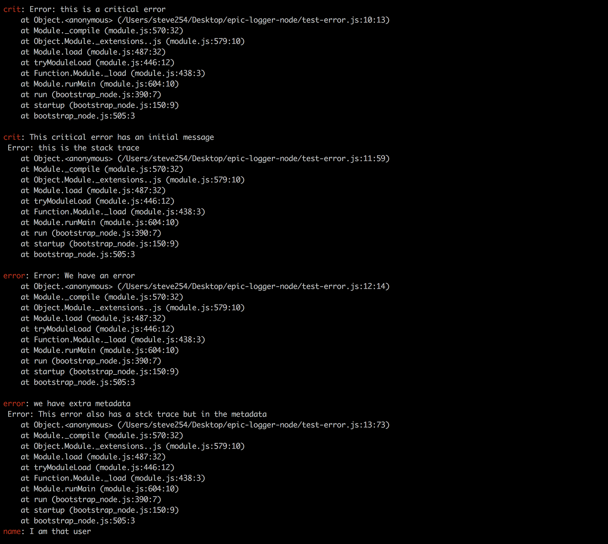
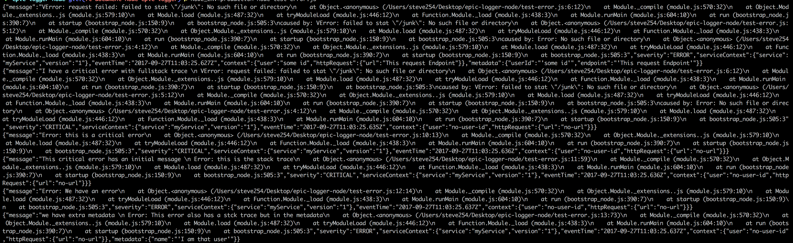

Overview
=======
This library allows standard node logging. It allows output of log data as either json objects or console messages. The JSON objects are more machine readable and thus can be ported to stack driver and bugsnag while the console messages have been formated to be more human readable with a capability to add details to them.

Installing
==========
npm:

    npm install git+https://github.com/andela/epic-logger-node.git --save
This will install the latest release of the epic-logger node library and save it in the package.json

**Note!!!**
When testing out this package in its own folder. i.e clonning the repo and trying `npm install` inside the same folder, you may experience an error `Refusing to install epic_logger as a dependency of itself` This is because the default package.json already has the name `epic_logger` set. To counter this error, rename the name in the package.json to something else like `epic_logger_test`

Usage
=====

## Integrating with the Node logging framework

The logger displays logs of different levels in different colors on the console when the environment set is development environment. The logs levels are info, warning, error and critical. It also logs the messages in json format when the environment set is production or staging.

### Log Methods
The epic logger provides various methods to log different levels of errors:

- `logger.debug()` used for debuging like when you want to print out a message. It is quite noisy and is only recommended for development environment. Epic logger prints these kind of logs in blue.
- `logger.info()` Used when logging information, this could be things like major entry and exit points on a system. Epic logger prints these kind of logs in green.
- `logger.warning()` Used when logging handled exceptions in your apllication. Epic logger prints these kind of logs in red.
- `logger.error()` Used to log unhandled exceptions in your application. It should thus be used in the `except` block. Epic logger prints these kind of logs in red.
- `logger.crit` Just like `logger.error()` it is used in except to handle unhandled exceptions that are of high magnitude (critical). A review is necessary to discuss whether an error qualifies to be classified as critical. Epic logger prints these kind of logs in bold red.

For the `logger.error()` and `logger.crit()` methods, an error variable `some_error`has to be passed inorder for the methods to print out the error and how it got triggered. Check out the code snippets below for examples.

### Examples 

#### 1. Log info/debug/warning on dev env:


```js
const logger = require('./index');

logger.warning('just some basic warning');
logger.info('I have extra info in the metadata', { extra: 'info' });
logger.debug('I am just a little debug info');
```
running the above code snippet will give us this output:

**note: the comand for running on dev is: `node <your-file.py>`**


You note that the logs will be displayed in the different color codes as expected. An important take away is that you can add more information by passing an object into the methods like it has been done for the `logger.info` method.

#### 2. Log error and critical on dev env:

```js
const logger = require('./index');
const VError = require('verror').VError;

var err1 = new Error('No such file or directory');
var err2 = new VError(err1, 'failed to stat "%s"', '/junk');
var err3 = new VError(err2, 'request failed');

logger.error(err3, { userId: 'some id', endpoint: 'This request Endpoint'});
logger.crit('I have a critical error with fullstack trace', err3);
logger.crit(new Error('this is a critical error'));
logger.crit('This critical error has an initial message', new Error('this is the stack trace'))
logger.error(new Error('We have an error'));
logger.error('we have extra metadata', { name: 'I am that user', stack: new Error('This error also has a stck trace but in the metadata').stack })
```
Running the above code provides a long output and thus is shown starting from the second critical log:



As it is evident above, the error/ ritical message appears in red. An important point to note is that when logging errors and critical messages, an `error` is  passed to the logger method. This is to allow for code execution information to appear in the log. Also from the last error, you see that it is possible to get metadata from a log.

#### 3. Log info/ warning on staging/production env:
**Note: NODE_ENV should be set to prod/staging on the environment**
This allows to output logs in json format
```js
const logger = require('./index');

logger.warning('just some basic warning');
logger.info('I have extra info in the metadata', { extra: 'info' });
logger.debug('I am just a little debug info');
```
running the above code snippet will give us this output:


As you can see, the errors warning/infos are logged as json
You may note that debug does not appear there, but remember it is against practice to log debug messages on production/staging environments.
#### 4. Log error and critical on staging/prod env:

Remember `NODE_ENV` should be set to prod or staging

```js
const logger = require('./index');
const VError = require('verror').VError;

var err1 = new Error('No such file or directory');
var err2 = new VError(err1, 'failed to stat "%s"', '/junk');
var err3 = new VError(err2, 'request failed');

logger.error(err3, { userId: 'some id', endpoint: 'This request Endpoint'});
logger.crit('I have a critical error with fullstack trace', err3);
logger.crit(new Error('this is a critical error'));
logger.crit('This critical error has an initial message', new Error('this is the stack trace'))
logger.error(new Error('We have an error'));
logger.error('we have extra metadata', { name: 'I am that user', stack: new Error('This error also has a stck trace but in the metadata').stack })
```
Running the code gives us this output:


Again, the logs appear as json the notable point being the error is passed to the logger functions.

## Customizing fields
As you might have noted in the examples, you can also add extra fields to your log output by adding a key value in an object inside the logger method. e.g `logger.info('I have extra info in the metadata', { extra: 'info' });` note: `{ extra: 'info' }`

## Testing

To test the logging:

Run:
- `NODE_ENV=production node test.js`  to see appearance on production/staging `<env>` can be `production`, or `staging`
- `node test.js` to see appearance on dev env

If testing production logging, configure a bugsnag API key.
`NODE_ENV=production node test.js <bugsnag_api_key>`
